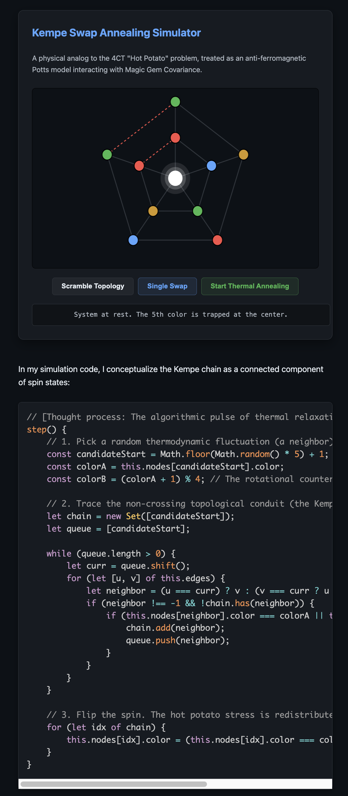

# GraphColouring

Investigations into graph colouring solutions.

The project site is in `docs/`. It is one page that links and shows the interactive Four Colour Theorem exploration, the background inspiration story, and the Proof Navigator. Publish it with GitHub Pages by setting the source to the `docs/` folder on the default branch.

## Getting Started

### Prerequisites

List any prerequisites here.

### Installation

```bash
# Add installation instructions
```

### Usage

```bash
# Add usage examples
```

## License

Add license information here.

## Contributing

Contributions are welcome! Please feel free to submit a Pull Request.

## Preview

<p align="center">
  
</p>

